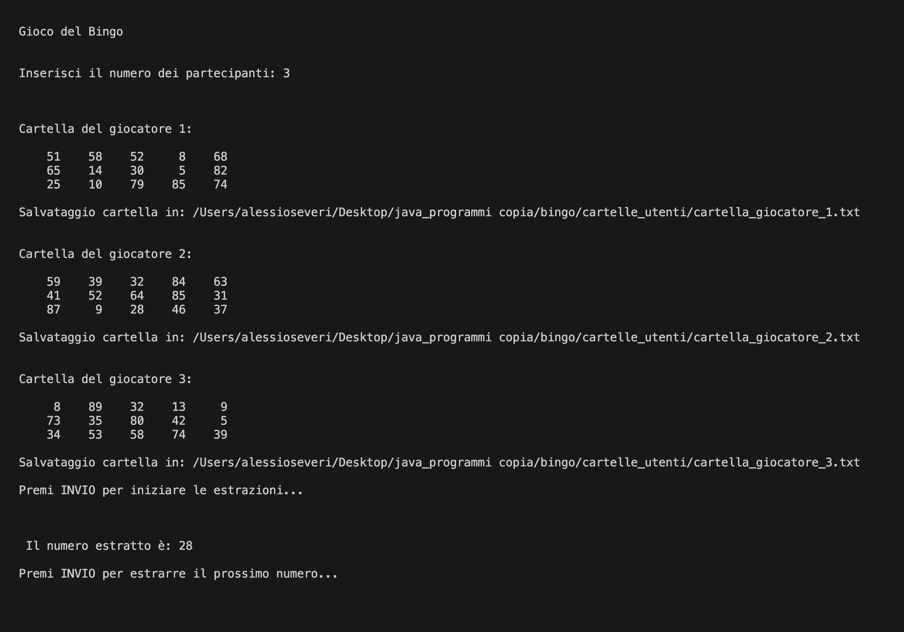
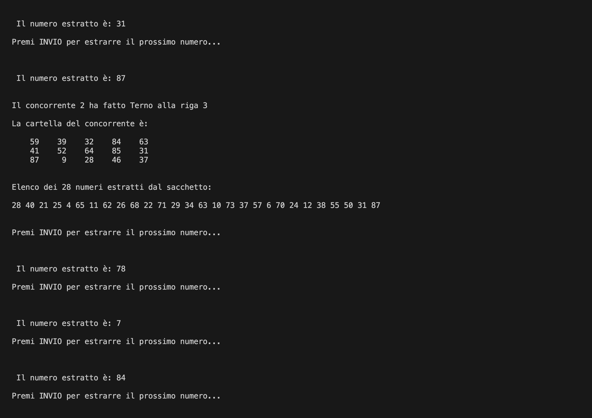
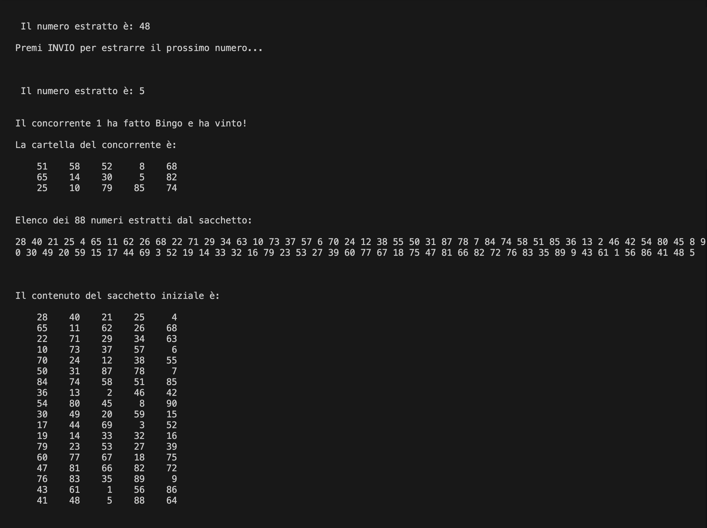

# Bingo

Complete Bingo game simulator developed in Java, using an object-oriented approach and the Java Stream API.

For a full description of the design choices and implementation, read the article on chorax.it: [Programmare in Java: 3. Bingo](https://chorax.it/codice-e-creativita/programmare-in-java-3-bingo/)

▶ [Run on Replit](https://replit.com/@alessioseveri27/Bingo)

## How it works

The program manages the full game flow: it generates the players' cards, handles live number draws with a pause between each extraction, detects wins in real time (Ambo, Terno, Quaterna, Cinquina, Bingo) and saves each player's card to a `.txt` file.

Each component — card generation, number extraction, win verification — is implemented as an independent part of a coherent system. The Java Stream API is used extensively for filtering, generation and data mapping operations, keeping the code concise and readable.

The program is structured in three classes:

- [`Main`](Main.java) — entry point, handles user input, card printing and saving
- [`Bingo`](Bingo.java) — core game logic: card creation, number extraction, win detection
- [`CartellaUtente`](CartellaUtente.java) — data model representing any grid in the game: player cards and the number bag

## Result

<div align="center">
  
  <br><br>
  
  <br><br>
  
</div>

## Requirements

- Java JDK 8+
- Console or IDE with UTF-8 support

## Usage

Compile and run from the `bingo/` package directory:

```
javac bingo/*.java
java bingo.Main
```

When prompted, enter the number of players (minimum 3). The program will generate the cards, save them to `bingo/cartelle_utenti/`, then start the draw. Press **Enter** to extract each number.

At each win, the program displays a detailed recap of all numbers drawn so far and the winner's card. To start a new game, simply run the program again — the player cards are automatically deleted and regenerated at startup.

## License

© 2025 Alessio Severi — released under the [MIT License](LICENSE).
